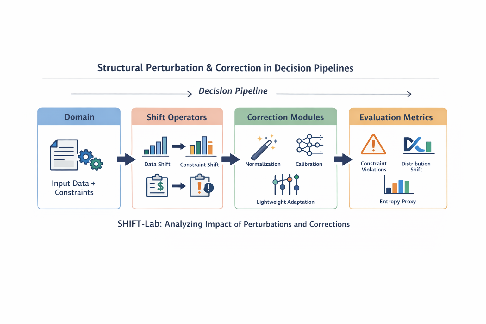

## shiftlab-llm

Experimental framework for studying structural perturbations and correction mechanisms in LLM-based decision pipelines.

SHIFT-Lab is not a generic robustness benchmark.
It is an experimental instrument for analyzing how structured shifts affect decision quality and constraint satisfaction, and how lightweight correction modules restore performance.
<p align="center">
  
</p>

## Core Idea

Modern LLM pipelines are deployed under changing conditions:
- Input distribution shifts
- Noise and format drift
- Constraint modifications (budgets, penalties, priorities)
- Calibration drift

SHIFT-Lab makes these perturbations explicit and measurable.

The framework separates three components:

1. **Shift Operators**

Structural perturbations applied to a domain (data shift, constraint shift, etc.).

2. **Correction Modules**

Lightweight adaptation layers (normalization, recalibration, low-cost adapters).

3. **Metrics**

Quantify degradation and recovery:
- Distribution divergence (e.g., token JSD)
- Constraint violation rate
- Entropy-based uncertainty proxy

The objective is to study:
- What breaks under structural perturbation?
- How sensitive is decision quality to constraint shifts?
- Which minimal correction mechanisms recover stability?

## Architecture

The pipeline follows:
Domain → Shift Operator → Correction Module → Evaluation Metrics

All components are modular and registered:
- `shift/` : data and constraint perturbations
- `adapt/` :correction modules
- `eval/` : evaluation and reporting
- `core/` : registries and typed interfaces

## Quickstart
```
pip install -e .
python -m shiftlab.cli run --config configs/demo.yaml
```

Constraint shift example:
```
python -m shiftlab.cli run \
  --config configs/demo_constraints_no_adapt.yaml
```

## Research Positioning

SHIFT-Lab focuses on:
- Structural robustness under constraint perturbations
- Correction under distribution and budget shifts
- Calibration and uncertainty proxies without labels
- Lightweight adaptation instead of full retraining