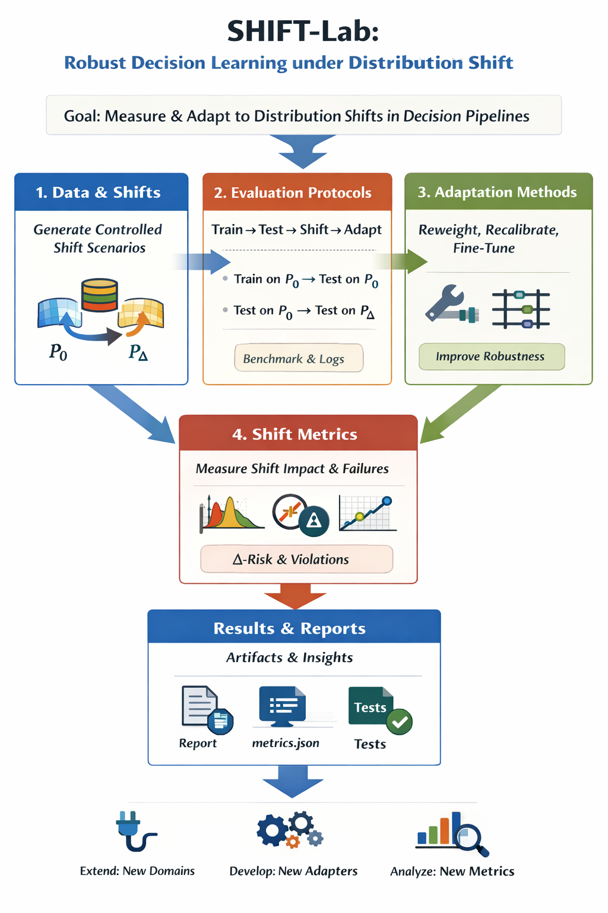

# shiftlab-llm

Research toolkit for diagnosing **domain shift** and testing lightweight **adaptation** strategies for LLM pipelines.

Shift-Lab overview diagram showing a pipeline with domain shift detection and LLM adaptation strategies, including input data transformation, model processing, and output evaluation stages.

<p align="center">
  
</p>

**SHIFT-Lab** is a research framework for studying **distribution shift in decision and optimization pipelines**.
The project provides controlled data-shift generators, standardized evaluation protocols, and quantitative metrics to measure how performance and constraint satisfaction degrade under shift. It also supports lightweight **adaptation methods** (e.g., reweighting, recalibration, partial fine-tuning) to study which strategies recover robustness without full retraining.
The goal is to **understand what breaks under shift, why it breaks, and what minimal fixes work**, in a reproducible and extensible benchmark.

## Quickstart
```bash
pip install -e .
python -m shiftlab.cli run --config configs/demo.yaml
